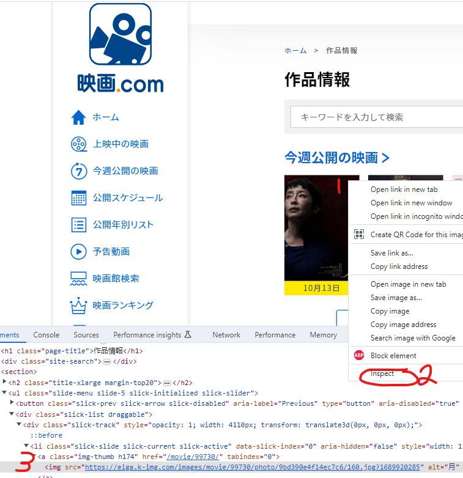

# ウェブスクレイピングのジャーニー

## 概要

Python でウェブスクレイピングのアプリケーションを開発するのジャーニーを解説します。

## 情報収集

まずウェブスクレイピングについての情報を収集するために、
"web scraping", "ウェブスクレイピング" などを検索しました。

* ウィキペディア：[ウェブスクレイピング](https://ja.wikipedia.org/wiki/ウェブスクレイピング) （定義）
* [Webスクレイピングとは？基本や仕組み、活用事例まで解説](https://www.octoparse.jp/blog/web-scraping) （詳しい説明）
  * [スクレイピングの違法性と注意事項について](https://www.octoparse.jp/blog/web-scraping#55スクレイピングの違法性と注意事項について) (重要ポイント)
* [How to perform Web Scraping using Selenium and Python](https://www.browserstack.com/guide/web-scraping-using-selenium-python) (チュートリアル)
* [PythonでWebスクレイピングをする方法を解説！【入門編】](https://udemy.benesse.co.jp/development/python-work/web-scraping.html) (チュートリアル)


### ウェブスクレイピングの基本的な流れ

1. ウェブページを取得する
1. 取得したウェブページを解析し、特定のデータを抽出する
1. 抽出したデータを保存する


## プロトタイプ

情報収集で見つかったものを基に最低限の機能があるプロトタイプを作成します。

目標：[映画.com](https://eiga.com/movie/) から今週公開予定の映画のポスターをダウンロードします。

### 依存ライブラリ

* ウェブページ取得
  * [Requests](https://requests.readthedocs.io/en/latest/user/quickstart#make-a-request)
* HTML解析
  * [BeautifulSoup](http://kondou.com/BS4/)

必要なライブラリを直接にコマンドラインで入力してインストールできます。
```
> pip install requests beautifulsoup4
```
または ライブラリを `requirements.txt` でリストアップして下記のコマンドを実行できます。
```
> pip install -r requirements.txt
```

### 特定のデータの検索方法

https://eiga.com/movie/ をブラウザで表示して欲しいデータのパターンを探します。
「今週公開の映画」の最初の画像を右クリックして要素を検証します。  


「今週公開の映画」のリストはページの中に最初に CSSのクラス(`class`)が `slide-menu` となっている要素です。  
そのリストの中に画像要素（タグ＝`img`）の `src` プロパティを参照したら画像ファイルをダウンロードできます。  
なお、映画のタイトルが `img` の `alt` プロパティに設定されます。
```

```

「今週公開の映画」のリストの各 `img` 要素をループしたら、欲しいデータを取得できます。

ソースコード： [prototype.py](prototype.py)
